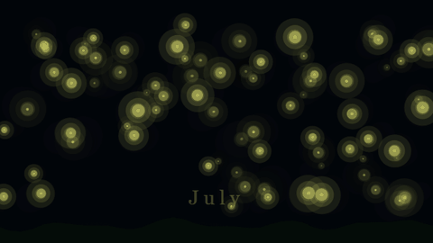
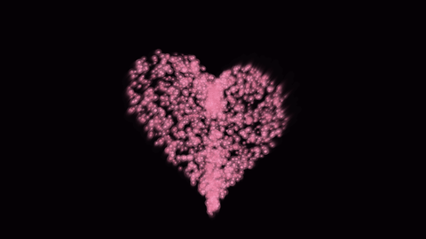
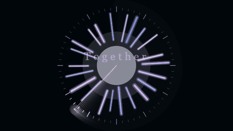
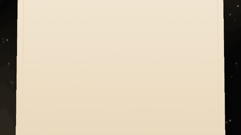

# Открытки

Переходи ниже, выбирай любую понравившуюся открытку: на чёрном фоне распускается цветок, выстраивается созвездие, разворачивается письмо. Каждая принимает имя и текст в URL — то есть ссылку можно отправить персонально, без правки кода, самостоятельно, ниже инструкция.

**Демо (тут все открытки):** https://vincere-mori.github.io/love/

## Превью

| светлячки | сердце |
|---|---|
|  |  |
| часы | письмо |
|  |  |

## Что есть

| Открытка | Что происходит |
|---|---|
| [пион](https://vincere-mori.github.io/love/cards/pion/) | 3D-пион распускается и увядает. Мышь поворачивает в пространстве, колесо — раскручивает. |
| [созвездие](https://vincere-mori.github.io/love/cards/sozvezdie/) | Звёздное небо, из звёзд складывается сердце, под ним — имя. Падающие звёзды по клику. |
| [сердце](https://vincere-mori.github.io/love/cards/serdtse/) | ~2400 частиц в форме сердца, пульсирует, поворачивается. По клику рассыпается и собирается обратно. |
| [письмо](https://vincere-mori.github.io/love/cards/pismo/) | Бумажное письмо разворачивается, строки проявляются по очереди, в углу — сургучная печать. Пыль в луче света. |
| [светлячки](https://vincere-mori.github.io/love/cards/svetlyachki/) | Тёплый июльский вечер: светлячки летают по полю, тянутся к курсору, по клику собираются в сердце. |
| [часы](https://vincere-mori.github.io/love/cards/chasy/) | Циферблат из лент, в центре — имя и дата (для годовщины, например). |

## Как послать своей

Просто докинь параметры в URL:

```
https://vincere-mori.github.io/love/cards/sozvezdie/?name=Аня&text=моё небо
https://vincere-mori.github.io/love/cards/serdtse/?text=для тебя
https://vincere-mori.github.io/love/cards/pismo/?name=Милая&text=строка раз|строка два|строка три&sign=твой С.
https://vincere-mori.github.io/love/cards/svetlyachki/?name=Аня&text=наш июльский вечер
https://vincere-mori.github.io/love/cards/chasy/?name=Аня и Саша&date=14 февраля 2024&text=наша вечность
```

В письме строки разделяются `|`. Кириллица и пробелы — нормально (браузер сам закодирует), но если пересылаешь в мессенджере, лучше просто скопировать ссылку из адресной строки.

Всё статика, ничего никуда не уходит.

## Управление

- **мышь** — лёгкий доворот / параллакс
- **колесо мыши** — раскрутить пион
- **клик** — взрыв сердца / звёздный дождь / сборка светлячков (зависит от карточки)

## Сделать свою

Каждая открытка — один `index.html` + p5.js с CDN. Правишь файл в `cards/<имя>/index.html`, меняешь что хочешь. Цветовая схема пиона лежит массивом `blooms` в начале скрипта.

Если сделаешь свою — кинь ссылку в issue, добавлю в галерею.

---

MIT · понравилось? [⭐ звезда](https://github.com/vincere-mori/love) или [чаевые](https://pay.cloudtips.ru/p/6c077990)

---

*Six generative cards in the browser — peony, constellation, heart, letter, fireflies, clock. Pass `?name=Anna&text=...` in the URL and share the link.* **[Live →](https://vincere-mori.github.io/love/)**
